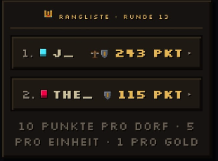

1.Normales Spiel & Ranked Modus trennen
- im Ranked soll es keinen zurück button geben
-Normale spiele sollen nicht auf die Elo sich auswirken, nur ranked spiele zählen

2. achievements hinzufügen

3. skins implementieren?!

4. login/account managment optimieren

6. namen werden in der rangliste im spiel nicht angezeigt 
